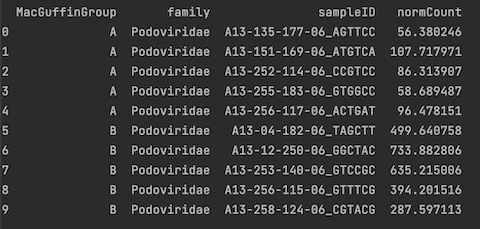
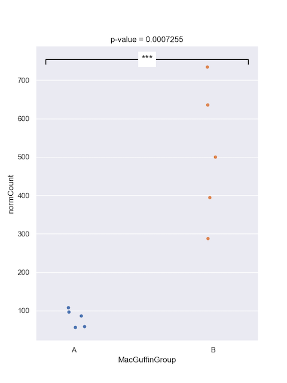
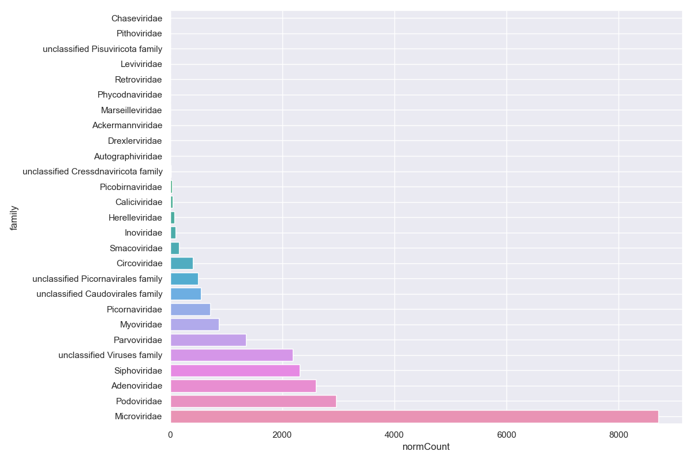

This section assumes you have completed [Tutorial Part3](tutorialPt3.md).

# Compare viral loads

In part 3, we compared the viral counts between the two sample groups for _Podoviridae_,
and it appeared as though group B had more viral sequence hits on average than group A.
We can compare the normalised counts for these two groups to see if they're significantly different.

**Student's T-test**

Let's check out the dataframe we made earlier that we'll be using for the test:

```python
print(podoCounts)
```



We'll use the python function `stats.ttest_ind`, which takes two vectors--one with the 
group A counts and one with the group B counts.
We will first filter then group the data before using the t-test function. You'll also need to import the 'stats' library

```python
#add to top with the other import statements
import scipy.stats as stats

#filter
virusesFilteredA = viruses[(viruses.family=='Podoviridae') & (viruses.alnType=='aa') & (viruses.evalue<1e-10) & (viruses.MacGuffinGroup == 'A')]
virusesFilteredB = viruses[(viruses.family=='Podoviridae') & (viruses.alnType=='aa') & (viruses.evalue<1e-10) & (viruses.MacGuffinGroup == 'B')]

#group by
podoCountsA = virusesFilteredA.groupby(by=['family','sampleID'], as_index=False)['normCount'].agg('sum')
podoCountsB = virusesFilteredB.groupby(by=['family','sampleID'], as_index=False)['normCount'].agg('sum')

#two-sided test
df = len(podoCountsA) + len(podoCountsB) - 2
t_stat, p_val = stats.ttest_ind(podoCountsA.normCount, podoCountsB.normCount, equal_var=True)

print(f"t-test= {t_stat:.4f}", "\n",
          f"p-value = {p_val:.7f}", "\n",
          f"Degrees of Freedom= {df:.0f}")
```

```text

t-test= -5.3033 
p-value = 0.0007255
Degrees of Freedom= 8

```
Alternative hypothesis: true difference in means is not equal to 0

Below is example of how to plot the p-value significant notation manually onto graph
```python
#plot
from matplotlib.markers import TICKDOWN
def significance_bar(start,end,height,displaystring,linewidth = 1.2,markersize = 8,boxpad  =0.3,fontsize = 15,color = 'k'):
    # draw a line with downticks at the ends
    plt.plot([start,end],[height]*2,'-',color = color,lw=linewidth,marker = TICKDOWN,markeredgewidth=linewidth,markersize = markersize)
    # draw the text with a bounding box covering up the line
    plt.text(0.5*(start+end),height,displaystring,ha = 'center',va='center',bbox=dict(facecolor='1.', edgecolor='none',boxstyle='Square,pad='+str(boxpad)),size = fontsize)

sns.set_style("darkgrid")
sns.set_palette("colorblind")
sns.set(rc={'figure.figsize':(6,8)})
ax = sns.stripplot(x="MacGuffinGroup",
                    y="normCount",
                    data=podoCounts, jitter=0.1)

#plot p-value
pValAsterisk = ''

if p_val < 0.0001:
    pValAsterisk = '****'
elif p_val < 0.001:
  pValAsterisk = '***'
elif p_val < 0.01:
  pValAsterisk = '**'
elif p_val < 0.05:
  pValAsterisk = '*'
else:
  'ns'

height = podoCounts["normCount"].max()+20
significance_bar(-.2,1.25,height,pValAsterisk)
ax.set_title(f"p-value = {p_val:.7f}")
plt.show()
```



**Wilcoxon test**
NOTE: TO DO - cross check R function and python are the same since its
coming up with different values. Suspect its because sample size is not
big enough.

You might prefer to perform a Wilcoxon test; the syntax is very similar to the t.test.
Something to note is that the python Wilcoxon function is best suited to sample sizes >20
so in this example n=10 so the p-value will be less accurate.
https://stackoverflow.com/questions/33579785/difference-between-wilcoxon-test-in-r-and-python

```python
#Wilcoxon test
stat, p = stats.wilcoxon(podoCountsA.normCount, podoCountsB.normCount)
print('Wilcoxon signed-rank test')
print('Statistics=%.3f, p=%.5f' % (stat, p))
```

```text
Wilcoxon rank sum exact test
Statistics=0.000, p=0.06250
```
Note - Wilcoxon p-value from R was used in this diagram


**Dunn's test**

TODO Dunn's Test In Python

Let's use Dunn's test to check all the major families at the same time.
Dunn's is good for if you have three or more categories for a metadata field, such as our vaccine column.
First find out what the major families are by summing the hits for each family and sorting the table.

```python
#filter
virusesFiltered = viruses[(viruses.alnType=='aa') & (viruses.evalue<1e-10)]

#group by
viralFamCounts = virusesFiltered.groupby(by=['family'], as_index=False)['normCount'].agg('sum')
viralFamCounts = viralFamCounts.sort_values(by=['normCount'])

# plot
sns.set_style("darkgrid")
sns.set_palette("colorblind")
sns.set(rc={'figure.figsize':(14,10)})
sns.barplot(x="normCount", y="family", data=viralFamCounts)
plt.subplots_adjust(left=0.2)
plt.grid(True)
plt.show()
```



Let's focus on _Siphoviridae_, _Adenoviridae_, _Podoviridae_, and _Microviridae_.
Collect summary counts for these families for each sample and include the metadata we want to use:

```R
viralMajorFamCounts = viruses %>% 
    filter(family %in% c('Siphoviridae','Adenoviridae','Podoviridae','Microviridae')) %>% 
    group_by(sampleID,family,vaccine) %>% 
    summarise(n=sum(normCount))
```

Now let's do the dunn's test for these families:

```R
viralMajorFamCounts %>% 
    group_by(family) %>% 
    dunn_test(n ~ vaccine,p.adjust.method='holm') %>% 
    add_significance()
```

```text
# A tibble: 12 × 10
   family       .y.   group1     group2        n1    n2 statistic      p  p.adj p.adj.signif
 * <chr>        <chr> <chr>      <chr>      <int> <int>     <dbl>  <dbl>  <dbl> <chr>       
 1 Adenoviridae n     Ad_alone   Ad_protein     3     2     0.467 0.641  1      ns          
 2 Adenoviridae n     Ad_alone   sham           3     4     0.438 0.661  1      ns          
 3 Adenoviridae n     Ad_protein sham           2     4    -0.105 0.916  1      ns          
 4 Microviridae n     Ad_alone   Ad_protein     4     2    -1.43  0.153  0.458  ns          
 5 Microviridae n     Ad_alone   sham           4     4    -0.584 0.559  0.681  ns          
 6 Microviridae n     Ad_protein sham           2     4     0.953 0.340  0.681  ns          
 7 Podoviridae  n     Ad_alone   Ad_protein     4     2     0.477 0.634  0.681  ns          
 8 Podoviridae  n     Ad_alone   sham           4     4     1.75  0.0798 0.240  ns          
 9 Podoviridae  n     Ad_protein sham           2     4     0.953 0.340  0.681  ns          
10 Siphoviridae n     Ad_alone   Ad_protein     4     2     2.48  0.0132 0.0395 *           
11 Siphoviridae n     Ad_alone   sham           4     4     1.40  0.161  0.322  ns          
12 Siphoviridae n     Ad_protein sham           2     4    -1.33  0.182  0.322  ns  
```

There's only one comparison that is significant.
Let's put it on a plot

```R
ggplot(viralMajorFamCounts) +
    geom_jitter(aes(x=vaccine,y=n)) +
    facet_wrap(~family)
```


END TODO Dunn's Test In Python

# Compare presence/absence

You might not care about viral loads and instead are just interested in comparing the presence or absence of viruses.
For this you could use a Fisher's exact test.
To perform this test you need to assign a presence '1' or absence '0' for each viral family/genus/etc for each sample.
What number of hits you use for deciding if a virus is present is up to you.

I want to be sure about the alignments, so I'll apply some stringent filtering cutoffs.
Then I'll assign anything with _any_ hits as 'present' for that viral family.
Let's look at _Myoviridae_ ... for no particular reason.
 
```python
#filter
virusesFiltered = viruses[(viruses.family=='Myoviridae') & (viruses.alnType=='aa') & (viruses.evalue<1e-30) & (viruses.alnlen>150) & (viruses.pident>75)]

#group by
myovirPresAbs = virusesFiltered.groupby(by=['sampleID'], as_index=False, dropna=False)['normCount'].agg('sum')
myovirPresAbs = pd.merge(myovirPresAbs, meta, on=["sampleID"], how="outer")
myovirPresAbs["normCount"].fillna(0, inplace = True)
myovirPresAbs = myovirPresAbs.assign(present = np.where((myovirPresAbs.normCount>0),1,0))
```

To do the Fisher's exact test we need to specify a 2x2 grid;
The first column will be the number with _Myoviridae_ for each group.
The second column will be the numbers without for each group.

```python
# matrix rows
#count of rows
mtxGroupAPresentCount = len(myovirPresAbs[(myovirPresAbs.MacGuffinGroup=='A') & (myovirPresAbs.present == 1)])
mtxGroupAAbsentCount = len(myovirPresAbs[(myovirPresAbs.MacGuffinGroup=='A') & (myovirPresAbs.present == 0)])
mtxGroupBPresentCount = len(myovirPresAbs[(myovirPresAbs.MacGuffinGroup=='B') & (myovirPresAbs.present == 1)])
mtxGroupBAbsentCount = len(myovirPresAbs[(myovirPresAbs.MacGuffinGroup=='B') & (myovirPresAbs.present == 0)])

#create matrix table
myovirFishMtx = np.array([[mtxGroupAPresentCount, mtxGroupAAbsentCount], [mtxGroupBPresentCount, mtxGroupBAbsentCount]])


```


```python
#Run Fisher's exact test
oddsr, p = stats.fisher_exact(myovirFishMtx)
print('Run Fishers exact test')
print('odds ratio=%.0f, p-value=%.5f' % (oddsr, p))
```

```text
Fisher's Exact Test for Count Data
odds ratio=0, p-value=0.04762
```

Alternative hypothesis: true odds ratio is not equal to 1

We don't have many samples, so our significance won't be great regardless.

In [Part 5](tutorialPt5.md) we will look at the contigs' read-based annotations.